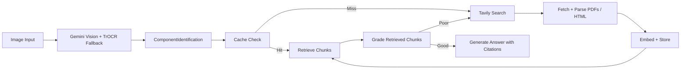

# Visual Technical Assistant

Production-grade AI system for identifying industrial and electronic components from an image and answering technical questions with citations from official documentation retrieved on demand.

[](https://visual-tech-assistant-504255859107.us-central1.run.app)


## Architecture



## How It Works

1. The user uploads or captures a photo of an industrial or electronic component.
2. Gemini Flash performs visual identification and structured extraction of manufacturer, model, part number, and component type.
3. If Gemini is uncertain about the part number, TrOCR runs as a focused OCR fallback.
4. The system normalizes the result into a deterministic cache key: `manufacturer::model::part_number`.
5. If the component is not already cached, Tavily searches for official documentation, then the system fetches, parses, chunks, embeds, and stores the source material.
6. A LangGraph corrective RAG pipeline retrieves candidate chunks, grades their relevance, refines the search when needed, and retries retrieval.
7. The answer node receives only retrieved chunks as context and returns an answer with source URL and page-level citations. Uncited answers are rejected.

## Tech Stack

| Category | Tools |
| --- | --- |
| API | Python 3.11, FastAPI, Uvicorn |
| Vision + OCR | Gemini Flash on Vertex AI for multimodal identification, TrOCR (`microsoft/trocr-large-printed`) as OCR fallback |
| Retrieval | LangGraph corrective RAG pipeline, LangChain document tooling |
| Search + Fetch | Tavily Search API, Trafilatura, PyPDF |
| Embeddings | Vertex AI `text-embedding-005` with `RETRIEVAL_DOCUMENT` and `RETRIEVAL_QUERY` task types |
| Vector Stores | ChromaDB for local/dev, Vertex AI Vector Search for production behind a shared abstraction |
| Metadata Persistence | Google Firestore |
| Infrastructure | Docker, GitHub Actions CI/CD, Google Artifact Registry, Google Cloud Run |
| Authentication | Workload Identity Federation for keyless GitHub to GCP authentication |

## Key Design Decisions

- Citation enforcement is architectural, not prompt-only. The answer generation node only receives retrieved chunks, and uncited answers are replaced with a safe fallback.
- Identification is anchored on OCR and part-number extraction. Visual recognition supports the process, but the normalized part number is the primary cache key.
- The cache is keyed by `manufacturer::model::part_number`, not by image, which makes retrieval deterministic and reusable across users and sessions.
- The vector store abstraction supports both ChromaDB and Vertex AI Vector Search through a single environment-variable switch.
- Corrective RAG is built into the agent graph. Low-quality retrieval is graded, the query is refined, and retrieval is retried before answer generation.
- The fallback chain is explicit: OCR match, partial OCR, visual-only identification, then manual-entry guidance.
- Power-related answers are instructed to distinguish between the device input specification and the adapter or power-supply specification.

## CI/CD Pipeline

Every push runs:

- `ruff check`
- `mypy` across backend and tests
- `pytest` with fully mocked external providers

Every merge to `main` runs:

1. Docker build
2. Push SHA-tagged and `latest` images to Artifact Registry
3. Deploy to Cloud Run through Workload Identity Federation

There are no long-lived JSON keys stored in GitHub.

## Local Development

### 1. Clone and create a virtual environment

```bash
git clone https://github.com/adhishezio/Visual-Technical-Assistant.git
cd Visual-Technical-Assistant
python -m venv .venv
source .venv/bin/activate
python -m pip install --upgrade pip
python -m pip install -r backend/requirements.txt
```

Windows PowerShell:

```powershell
git clone https://github.com/adhishezio/Visual-Technical-Assistant.git
cd Visual-Technical-Assistant
py -3.11 -m venv .venv
.\.venv\Scripts\Activate.ps1
python -m pip install --upgrade pip
python -m pip install -r backend/requirements.txt
```

### 2. Configure environment variables

```bash
cp .env.example .env
```

Windows PowerShell:

```powershell
Copy-Item .env.example .env
```

Fill in the required keys in `.env` before running the API.

### 3. Run with Docker Compose

```bash
docker compose up --build
```

The API will be available at:

- `http://localhost:8000/`
- `http://localhost:8000/docs`
- `http://localhost:8000/health`

### 4. Run tests locally

```bash
python -m mypy --config-file mypy.ini backend tests
python -m pytest tests
```

### 5. Run the frontend locally

```bash
cd frontend
npm install
printf "NEXT_PUBLIC_API_URL=https://visual-tech-assistant-504255859107.us-central1.run.app\n" > .env.local
npm run dev
```

Windows PowerShell:

```powershell
cd frontend
npm install
Set-Content .env.local "NEXT_PUBLIC_API_URL=https://visual-tech-assistant-504255859107.us-central1.run.app"
npm run dev
```

The Next.js UI will be available at `http://localhost:3000`.

## API Endpoints

| Method | Path | Description | Request | Response |
| --- | --- | --- | --- | --- |
| `GET` | `/` | Service index for humans and simple uptime checks | None | JSON with service description and important URLs |
| `GET` | `/health` | Health status and vector-store readiness | None | `{"status": "ok|degraded", "vector_store_healthy": bool}` |
| `POST` | `/identify` | Vision/OCR identification only | `multipart/form-data` with `image` | `ComponentIdentification` |
| `POST` | `/query` | Full identify → retrieve → answer pipeline | `multipart/form-data` with `image` and `question` | `AnswerWithCitations` |

Example `curl` requests:

```bash
curl -X POST http://localhost:8000/identify \
  -F "image=@test_images/s200-m-uc-range-product-image-large.jpg"
```

```bash
curl -X POST http://localhost:8000/query \
  -F "image=@test_images/s200-m-uc-range-product-image-large.jpg" \
  -F "question=What is the rated current?"
```

## Environment Variables

| Variable | Required | Default / Example | Purpose |
| --- | --- | --- | --- |
| `APP_NAME` | No | `Visual Technical Assistant API` | FastAPI application title |
| `ENVIRONMENT` | No | `local` | Runtime mode |
| `DEBUG` | No | `false` | FastAPI debug flag |
| `VECTOR_STORE` | Yes | `chroma` | Selects `chroma` or `vertex` backend |
| `EMBEDDING_PROVIDER` | Yes | `vertex` | Selects `vertex` or `hashing` embedder |
| `EMBEDDING_MODEL` | Yes | `text-embedding-005` | Vertex embedding model name |
| `EMBEDDING_DIMENSION` | Yes | `768` | Embedding vector size |
| `CHROMA_PERSIST_DIRECTORY` | No | `db` | Local Chroma persistence path |
| `CHROMA_COLLECTION_NAME` | No | `component_documentation` | Chroma collection name |
| `CHROMA_DISTANCE_METRIC` | No | `cosine` | Chroma similarity metric |
| `CHROMA_ANONYMIZED_TELEMETRY` | No | `false` | Disables Chroma telemetry |
| `ONNXRUNTIME_LOG_SEVERITY_LEVEL` | No | `4` | Reduces ONNX Runtime log noise |
| `VISION_PROVIDER` | Yes | `gemini` | Vision provider selection |
| `OCR_PROVIDER` | Yes | `trocr` | OCR provider selection |
| `IDENTIFICATION_CONFIDENCE_THRESHOLD` | No | `0.6` | Overall identification threshold |
| `PART_NUMBER_CONFIDENCE_THRESHOLD` | No | `0.75` | Part-number threshold before OCR fallback |
| `GOOGLE_CLOUD_PROJECT` | Yes | `your-gemini-project-id` | Project for Gemini and general Google services |
| `GOOGLE_CLOUD_LOCATION` | No | `us-central1` | Region for Gemini and general Google services |
| `CORS_ALLOW_ORIGINS` | No | `["http://localhost:3000","http://127.0.0.1:3000"]` | Browser origins allowed to call the FastAPI backend |
| `GOOGLE_API_KEY` | Yes | `your-google-api-key` | Gemini API key |
| `GEMINI_MODEL` | Yes | `gemini-2.5-flash` | Configured Gemini Flash model |
| `VERTEX_PROJECT_ID` | Required for Vertex embeddings or Vector Search | `your-vertex-project-id` | Billing project for Vertex AI |
| `VERTEX_AI_LOCATION` | Required for Vertex embeddings or Vector Search | `us-central1` | Vertex AI region |
| `VERTEX_INDEX_ENDPOINT_ID` | Required when `VECTOR_STORE=vertex` | `projects/.../indexEndpoints/...` | Vertex Vector Search endpoint |
| `VERTEX_DEPLOYED_INDEX_ID` | Required when `VECTOR_STORE=vertex` | `component_docs_v1` | Deployed index identifier |
| `FIRESTORE_COLLECTION` | Required when `VECTOR_STORE=vertex` | `component_chunks` | Firestore collection for chunk metadata |
| `FIRESTORE_PROJECT_ID` | Required when `VECTOR_STORE=vertex` | `your-vertex-project-id` | Firestore project |
| `TROCR_MODEL` | No | `microsoft/trocr-large-printed` | OCR fallback model |
| `TROCR_DEVICE` | No | empty | Optional TrOCR device override |
| `TROCR_MAX_NEW_TOKENS` | No | `64` | TrOCR decode limit |
| `SEARCH_PROVIDER` | Yes | `tavily` | Search provider selection |
| `TAVILY_API_KEY` | Yes | `your-tavily-api-key` | Tavily search key |
| `TAVILY_MAX_RESULTS` | No | `5` | Search result limit |
| `HTTP_TIMEOUT_SECONDS` | No | `20` | External HTTP timeout |
| `DOCUMENT_CHUNK_SIZE` | No | `1200` | Chunk size for parsed documents |
| `DOCUMENT_CHUNK_OVERLAP` | No | `200` | Chunk overlap for parsed documents |
| `MAX_FETCH_ATTEMPTS` | No | `2` | Corrective retrieval fetch retries |
| `SIMILARITY_SEARCH_K` | No | `4` | Number of retrieved chunks |

## Project Structure

```text
backend/
  api/routes/          FastAPI endpoints (identify, query)
  agent/               LangGraph graph, nodes, state, prompts
  core/                Config and typed pipeline models
  services/            Vision, search, fetch, and embed services
  vector_store/        Abstract base plus ChromaDB and Vertex AI implementations
frontend/              Next.js UI generated from v0 and wired to the live API
tests/                 22 unit tests with mocked provider integrations
.github/workflows/     ci.yml with lint, typecheck, test, and deploy jobs
Dockerfile
docker-compose.yml
firestore.indexes.json
_legacy/               Archived original Curious Curator scripts
```

## License

This project is licensed under the Apache 2.0 License. See [LICENSE](LICENSE).
